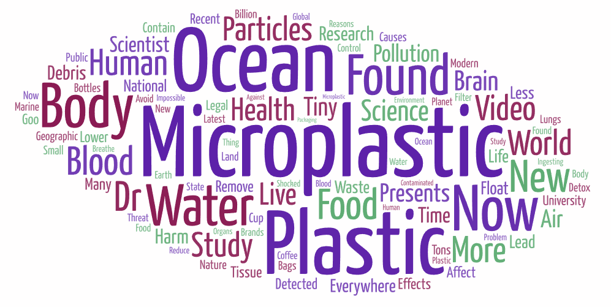
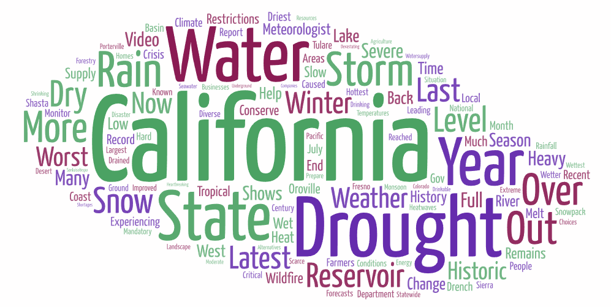
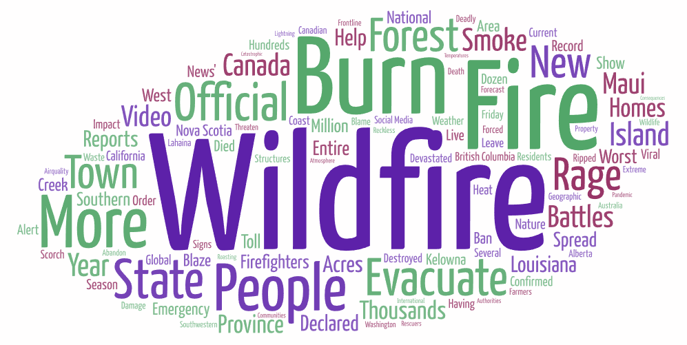

# GEOG458 Lab2
Created by: Elizabeth Luna
# Word Clouds
1st Image: "Microplastic"

2nd Image: "California Drought"

3rd Image: "Wildfire"

# Explanation
For my word clouds, I centered my topics around geographical issues, especially those that are relevant in current times. For the topics, I choose the keywords: "Microplastics," "California Drought," and "Wildfires." I decided to focus on these specific keywords because they are somewhat intertwined yet distinct geographical issues. For the 'California Drought' and 'Wildfires' terms, they are both the result of climate change and the consequences on the environment. In addition, the 'Mircoplastics' term can contribute to climate change because of the waste that is being generated and is not able to degrade fast enough. 

A similiarity among the word clouds is the terms communicating urgency and a sense of crisis. In additon, the word 'More' is all three word clouds implying that the issue is only growing bigger rather than decreasing. In addition, the biggest terms in all three word clouds are those that are commonly thought of when one thinks of the term. This predictability makes it easy to understand the issue at hand. 

A possible reason for the patterns that I observed, was the result of dire geographical crisis's that are ongoing and only growing in problem. All three word clouds communicated this sense of urgency, which made some words show up more often than others. 

My research could be improved in the future by choosing more specific keywords that can help filter out the less relevant words, and can result in a more accurate depiction of the geographical issue. 

Something that stands out to me was the 'help' that can be seen in the third word from on wildfires. The amount of times it must have shown up to be in a bigger font makes me think of the types of videos that were being published while an ongoing wildfire was raging through an area. In addition, the emotions that the victims were feeling during a particular wildfire event also comes to mind while looking at the word cloud.

# Data Tables
Download the csv files here:
* [Dataset 1][]
* [Dataset 2][]
* [Dataset 3][]

[Dataset 1]: assets/1-microplastics.csv
[Dataset 2]: assets/2-californiadrought.csv
[Dataset 3]: assets/3-wildfires.csv